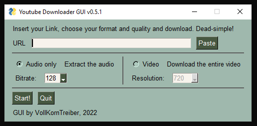

# vktYT_dl_GUI

This is a simple GUI for quick download of YT (and other) videos and extract mp3's. 
Straightforward with no BS unlike any other commercial downloader software out there. :)

<h2>Requirements</h2>
<ul>
<li>Youtube_dl library by ytdl-org, preferably installed via pip3: https://github.com/ytdl-org/youtube-dl</li>
<li>PySimpleGUI library, preferably installed via pip3: https://github.com/PySimpleGUI/PySimpleGUI</li>
<li>ffmpeg.exe, either in directory or installed via console: https://github.com/FFmpeg/FFmpeg</li>
</ul>

<h2>Troubleshooting</h2>

<ul>
<li>	Q: I'm getting an "HTTP Error 403: Forbidden". 
	A: Just press "Start" and try again. This might happen sometimes and has to do with Youtube's servers. </li>
<li>	Q: I'm getting a "Could not be resolved" error when downloading from YT. 
	A: This is because YT made some changes. You'll need to update the ytdl library. If it doesn't work with pip, then do it manually by downloading the fixed version from the original GitHub repo and replacing the library files manually on your computer. </li>
</ul>

<h2>Changelog:</h2>

<li>v0.5.1
<ul>
<li>Added more extensive exception handling when a library is missing</li>
</ul>
</li>

<li>v0.5
<ul>
<li>Added README.md</li>
<li>Added resolution options for video download</li>
<li>Added basic exception handling</li>
</ul>
</li>

<li>WIP220813:
<ul>
<li>Started documenting.</li>
</ul>
</li>
